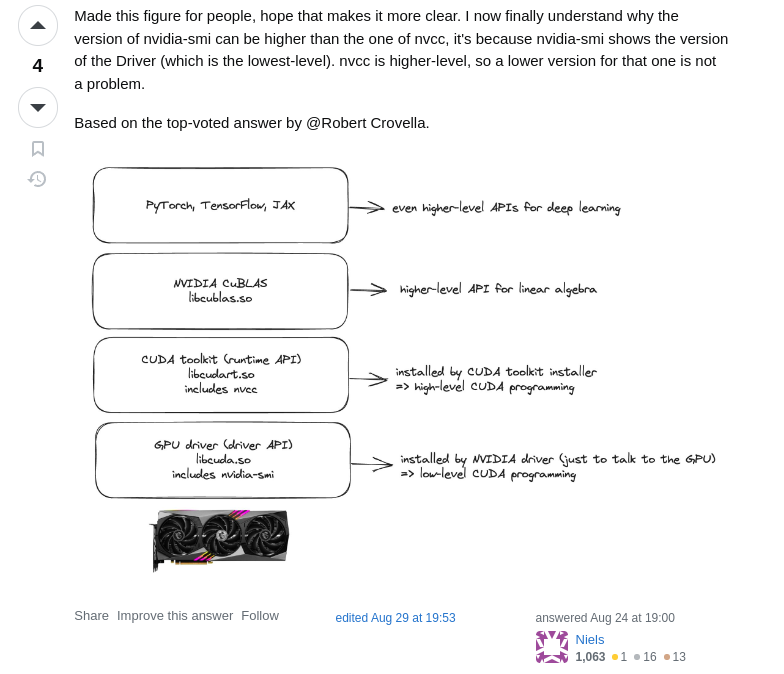

# cuda-upgrade-steps

Steps to upgrade the CUDA driver and toolkit. Including steps from Lonce.   
Note: Before all the steps below, I upgraded Ubuntu on my local from 18.0.4 -> 20.04 -> 22.04

Date: 7th January 2024  
Also note: Most steps below are from Nvidia's [CUDA installation page](https://docs.nvidia.com/cuda/cuda-installation-guide-linux/index.html)
## Pre-installation
1. ```sudo apt update && sudo apt upgrade```  
2. ```sudo apt autoremove nvidia* --purge```
3. ```sudo apt-get install linux-headers-$(uname -r)```
4. ```sudo apt-key del 7fa2af80```

## Download and install
See which CUDA you should download - [here](https://developer.nvidia.com/cuda-downloads). I chose the 'network repo' method.  
1. ```wget https://developer.download.nvidia.com/compute/cuda/repos/ubuntu2204/x86_64/cuda-keyring_1.1-1_all.deb```
2. ```sudo dpkg -i cuda-keyring_1.1-1_all.deb```
3. ```sudo apt-get update```
4. ```sudo apt-get -y install cuda-toolkit-12-3```
5. ```sudo reboot```

## After reboot
1. ```sudo apt-get install -y nvidia-kernel-open-545```  
2. ```sudo apt-get install -y cuda-drivers-545```
  
  
# More Important Notes
### Why are my CUDA versions on ```nvidia-smi``` and ```nvcc --version``` different? 
Nvidia drivers and CUDA toolkits are TWO different things. The driver is the software for the GPU, whereas the CUDA toolkit is a bunch of software programs to connect with the driver software on the GPU. See the helpful diagram below from Stackoverflow. (See original post here - [https://stackoverflow.com/questions/53422407/different-cuda-versions-shown-by-nvcc-and-nvidia-smi](https://stackoverflow.com/questions/53422407/different-cuda-versions-shown-by-nvcc-and-nvidia-smi))  



The cuda toolkit comes with its own 'version' of runtime driver. Further, ```nvidia-smi``` shows the CUDA version of the GPU driver and ```nvcc --version``` shows the CUDA version of the toolkit (TWO different things). 
So sometimes, when you install a higher version of the GPU driver software (demonstrated by CUDA version on ```nvidia-smi```), ```nvcc --version``` can still show a lower CUDA version. And it is OK. Things will still work.  

If you are like me and want to upgrade everything so that nvcc versions match with nvidia-smi - I found the cleanest way to fix this was to follow all the steps from the start of this README file.    


Important Links:
* https://docs.nvidia.com/cuda/cuda-installation-guide-linux/index.html#download-the-nvidia-cuda-toolkit  
* https://developer.nvidia.com/cuda-downloads?target_os=Linux&target_arch=x86_64&Distribution=Ubuntu&target_version=22.04&target_type=deb_local  
* https://gist.github.com/denguir/b21aa66ae7fb1089655dd9de8351a202  (Note: This is a superb Gist. With the steps in this Gist, unfortunately, you may land up with different CUDA versions in ```nvidia-smi``` and ``nvcc --version```
